# Lab5Web
TUGAS PERTEMUAN 6
| Nama | Moch. Nauval Faris Muzaki |
| --- | --- |
| NIM | 312010122 |
| Kelas | TI.20.B1
| Mata Kuliah | Pemrograman Web |

1. **Pengenalan JavaScript** 
Gambar dibawah Menunjukan langkah awal pengenalan JavaScript.
 

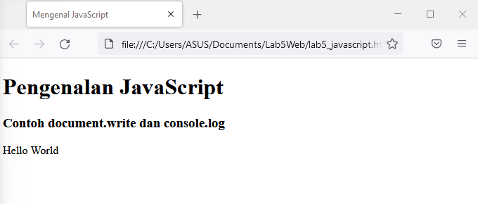
 

2. **Javascrip Dasar ** 
Pemakaian Alert sebagai property window. Berikut Untuk tampilannya.
 

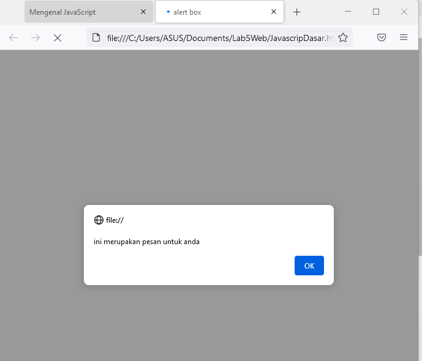
 

3. **Javascrip Dasar **  
Pemakaian method dalam objek. Berikut untuk tampilannya.
 

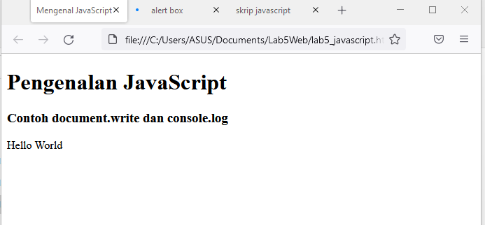
 

4. **Javascrip Dasar **  
Pemakaian prompt. Berikut untuk tampilannya.
 

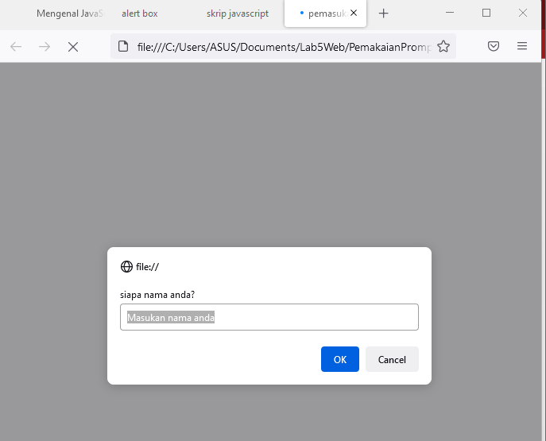
 
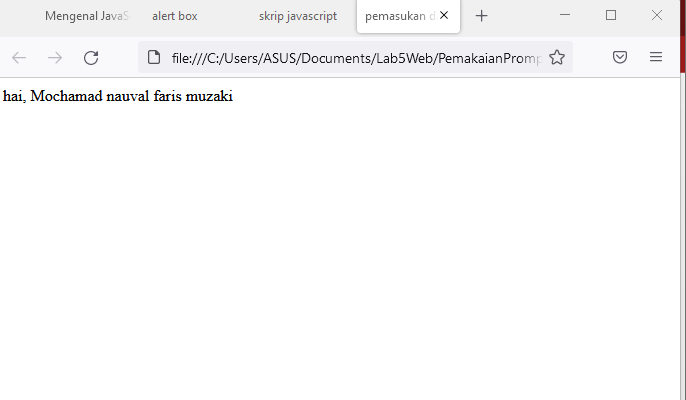
 

5. **Javascrip Dasar **  
Pembuatan fungsi dan cara pemanggilannya. Berikut untuk tampilannya.
 

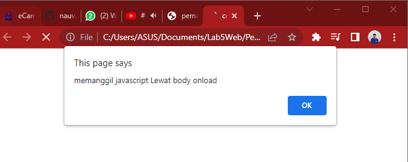
 

6. **Dasar Pemrograman Di Javascript**  
Operasi dasar aritmatika, Berikut Untuk tampilannya
 

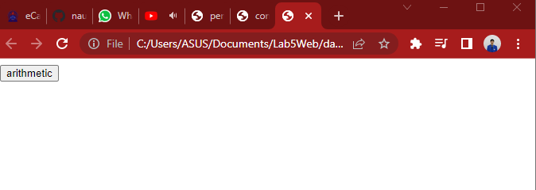
 
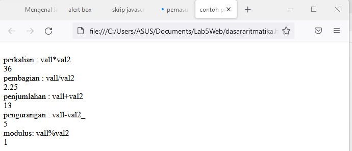
 

7. **Dasar Pemrograman Di Javascript**  
Seleksi kondisi (if..else), berikut untuk tampilannya
 

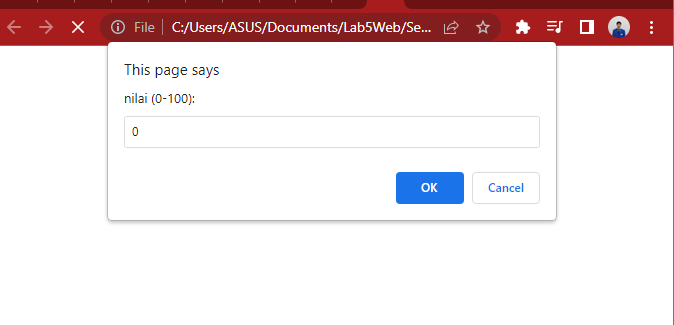
 

8. **Dasar Pemrograman Di Javascript**  
Penggunaan operator switc untuk seleksi kondisi, berikut untuk tampilannya.
 

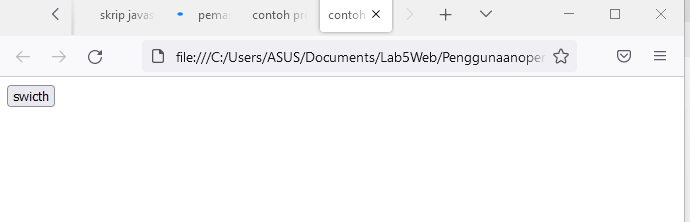
 
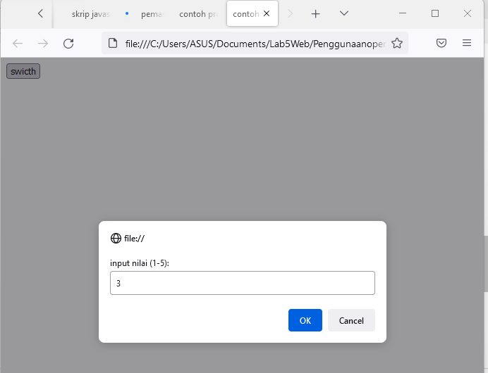
 

9. **Dasar Pemrograman Di Javascript**  
Pembuatan Form Input, Berikut untuk tampilannya  

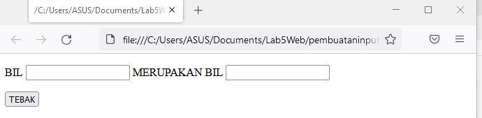
 

